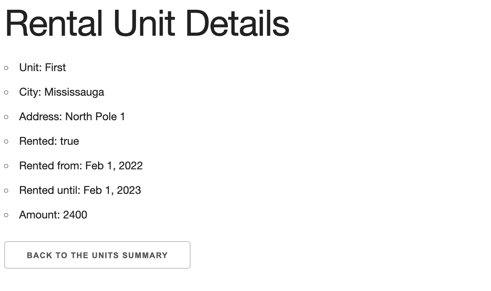

# Nook

This app aims to properly track expenses for each rental for small to medium landlords. Landlords can add their properties to the list, add all essential information and track the budget against each unit.

#### A site built from scratch as my first full application project.

## Description
The Nook is my first attempt to create a full-stack application. The intention of developing this application is to demonstrate and practice node.js, express, Mongoose and RESTful routes logic and connect it with HTML and style in CSS in a very condensed period. 

## Table of Contents
* [Technologies Used](#technologiesused)
* [Features](#features)
* [Design](#design)
* [Project Next Steps](#nextsteps)
* [Deployed App](#deployment)
* [About the Author](#author)

## Technologies Used
* Node.js
* Express
* Mongoose
* RESTful routes

## Features
* Users can view the list of their units
* Users can create a new unit and add it to their portfolio
* Users can see the timer and have only 60 seconds to win the game
* Users can match 2 the same cards and see it on the screen 
* Users can see a pop-up window if the won the game or lost the game and play again 
* Users can match all 16 cards
  
## Whiteboard Scetches
* Original Whiteboard sketch
* [[Miro]([https://miro.com/app/board/uXjVNdX8i8M=/])
  
## Design
* Design elements implemented using node.ejs 

## Project Next Steps
* Users can create detailed budget for each unit
* Users can upload contracts and files 
* The application needs to have a login page for each user 
* Users can access only their information 
* Users can see budgets only under certain units 

## Deployed Link
[Memory_Game](https://arlosa999.github.io/Memory-Game/)

* You can view the repository:
[Github.com](https://github.com/Arlosa999/Memory-Game)
* If unable to view please go live locally through VS Code
    
## Works Cited:
* N/A

## About The Author
I am an inspired entrepreneur and am learning code to find my company one day. Here is my first attempt to build a full-stack application to practice application development. I look for creative solutions to real-world problems and think of technical ways to address them. While no application is ever perfect, I find joy in the process and all my final products!
